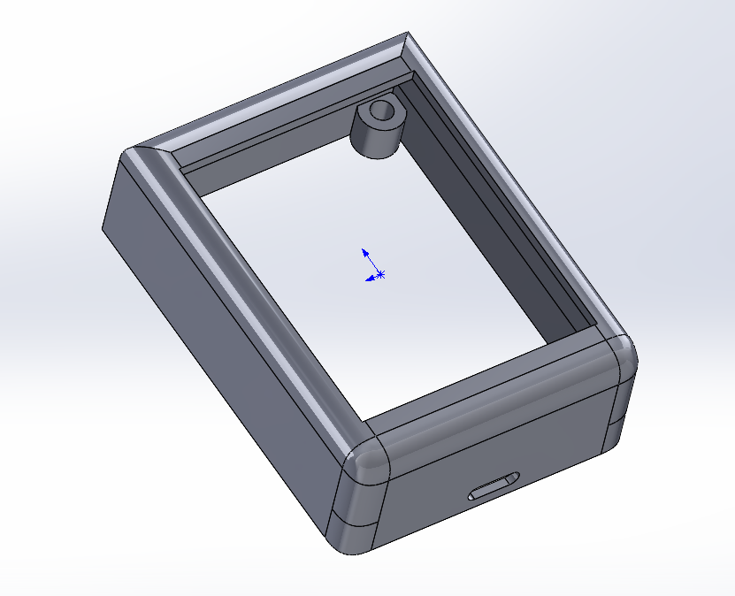
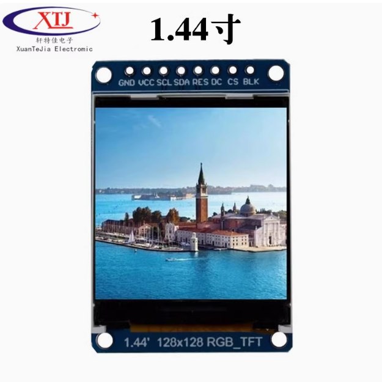
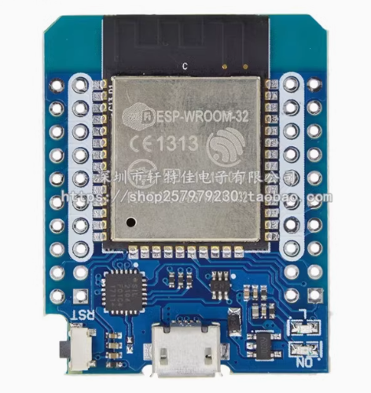

# esp32_mini_tft
针对FT7735驱动的128*128 RGB_TFT做适配；
esp32模块是MINI D1 ESP32
在使用过程中发现lvgl中适配好的的TF7735驱动无法直接使用；固修改为自己的使用io方式的驱动

# 编译 
1. 工程需要使用vscode下载使用esp-idf插件；
2. 同时下载esp-idf使用；

# 引脚
- ST7735_DC   16
- ST7735_SDA  21
- ST7735_SCL  22
- CS接地

solidworks中保存的是画的外壳；

